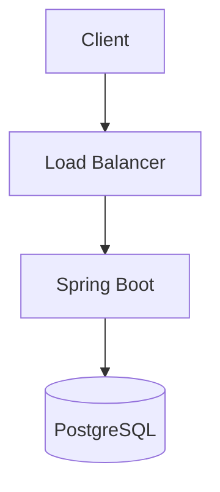
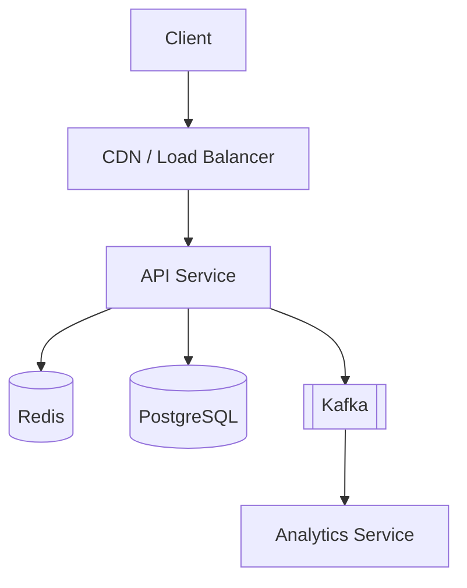
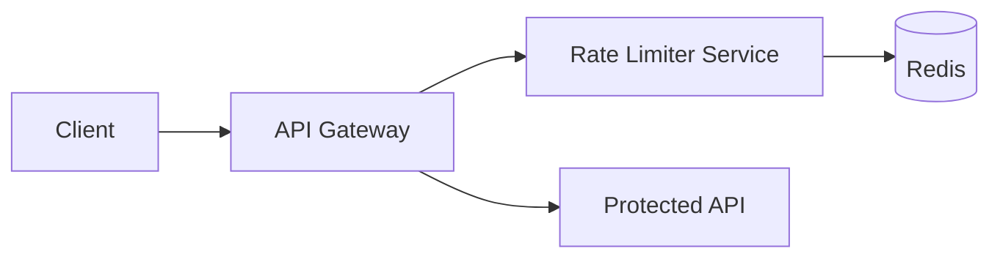
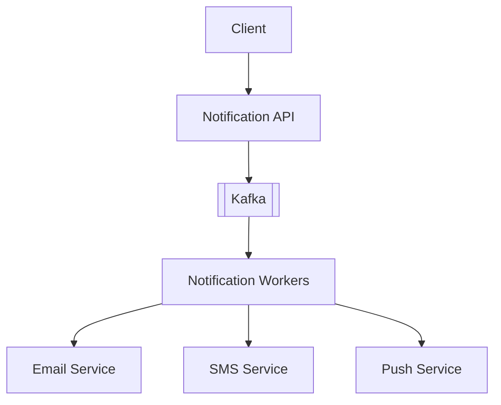
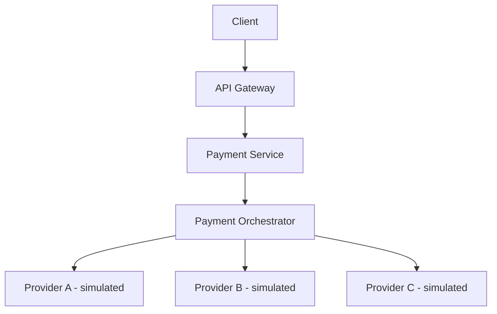
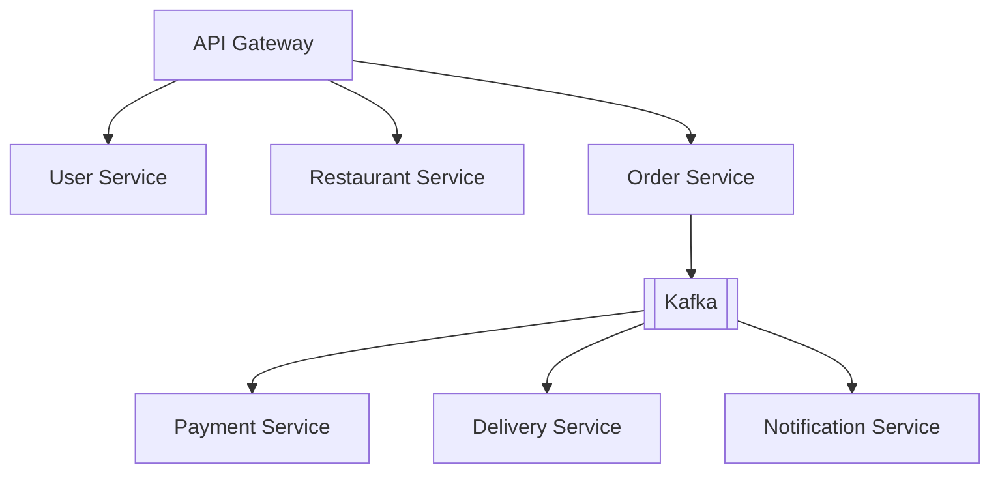
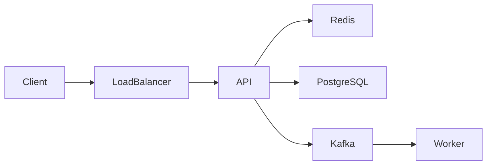

<div align="center">

# 🏗️ System Design

### Designing scalable, reliable and maintainable software systems.


> A practical system-design learning lab focused on understanding how large-scale software systems are architected, built, scaled, secured, observed, and evolved.

**Learn → Design → Build → Measure → Improve**

</div>

> **A note on badges:** technology badges are grey and marked *planned* until that technology is actually implemented in this repository. They turn green only when working code, tests and documentation exist. See [Technology Stack](#technology-stack).

---

## 📚 Contents

- [About](#about)
- [Engineering Philosophy](#engineering-philosophy)
- [Repository Structure](#repository-structure)
- [System Design Roadmap](#system-design-roadmap)
- [Projects](#projects)
- [System Design Template](#system-design-process)
- [Architecture Decision Records](#architecture-decision-records)
- [Senior Engineer Roadmap](#roadmap-to-senior-software-engineer)
- [Skill Matrix](#senior-engineer-skill-matrix)
- [Interview Preparation](#interview-preparation)
- [Engineering Metrics](#engineering-metrics)
- [Technology Stack](#technology-stack)
- [Progress Tracker](#learning-progress)
- [Development Workflow](#development-workflow)
- [Portfolio Goals](#portfolio-goals)

---

<a id="about"></a>
## 📖 About

This repository documents my journey from backend/software engineer toward **Senior Software Engineer**, with a strong focus on system design and distributed systems. It is a long-term learning and portfolio project, and it will grow continuously.

It contains:

| Area | What lives here |
| --- | --- |
| Notes and diagrams | System design notes, architecture diagrams, design patterns |
| Core concepts | Distributed systems, scalability, caching, messaging, event-driven architecture |
| Data and APIs | Database design, API design |
| Architecture | Microservices, trade-off analysis, Architecture Decision Records (ADRs) |
| Operations | Observability, reliability and fault tolerance, security, cloud architecture |
| Practice | Real-world system design projects and interview preparation |

### The loop

```text
Learn  →  Design  →  Build  →  Measure  →  Improve
  ▲                                            │
  └────────────────────────────────────────────┘
```

The goal is **not** to memorize system-design interview answers. The goal is to understand **why systems are designed the way they are** and how to make sound engineering trade-offs.

### Status legend

Every item in this repository carries an honest status:

| Indicator | Meaning |
| --- | --- |
| 🟢 Completed | Implemented, documented and verified |
| 🟡 In Progress | Actively being worked on |
| ⚪ Planned | Intended, not started |

Claims about performance or scale are only made where they have been **measured** and the results are documented. Until then they are learning objectives or experiments, not facts. A toy project does not by itself prove production expertise, and this repository does not pretend otherwise.

---

<a id="engineering-philosophy"></a>
## 🧠 Engineering Philosophy

### Understand before implementing
Do not blindly copy architectures. Understand the problem, its constraints and its users first.

### Start simple
Begin with a modular monolith or other simple architecture before introducing distributed systems. Distribution is a cost you pay when the problem demands it.

### Scale based on evidence
Scaling should be driven by measured bottlenecks, not by prematurely adding infrastructure. Measure, find the constraint, fix that constraint, measure again.

### Every trade-off matters
System design is the discipline of choosing between competing qualities:

| | | |
| --- | --- | --- |
| Consistency | Availability | Latency |
| Cost | Complexity | Reliability |
| Scalability | Security | Maintainability |

There are no free choices. Improving one usually costs another, and writing that cost down is part of the work.

### Design for failure
Assume that:

- Networks fail
- Services fail
- Databases fail
- Messages are duplicated
- Requests are retried
- Dependencies become unavailable
- Traffic spikes
- Deployments go wrong

---

<a id="repository-structure"></a>
## 📁 Repository Structure

```text
system-design/
│
├── README.md
│
├── fundamentals/
│   ├── scalability/
│   ├── availability/
│   ├── reliability/
│   ├── consistency/
│   ├── CAP-theorem/
│   └── distributed-systems/
│
├── architecture/
│   ├── monolith/
│   ├── modular-monolith/
│   ├── microservices/
│   ├── event-driven/
│   └── hexagonal/
│
├── databases/
│   ├── sql/
│   ├── nosql/
│   ├── indexing/
│   ├── replication/
│   ├── partitioning/
│   └── sharding/
│
├── caching/
│   ├── redis/
│   ├── cache-aside/
│   ├── write-through/
│   └── invalidation/
│
├── messaging/
│   ├── kafka/
│   ├── rabbitmq/
│   ├── pub-sub/
│   └── event-driven/
│
├── api-design/
│   ├── rest/
│   ├── graphql/
│   ├── grpc/
│   └── rate-limiting/
│
├── observability/
│   ├── logging/
│   ├── metrics/
│   ├── tracing/
│   └── alerting/
│
├── security/
│   ├── authentication/
│   ├── authorization/
│   ├── oauth2/
│   └── threat-modeling/
│
├── projects/
│   ├── 01-url-shortener/
│   ├── 02-rate-limiter/
│   ├── 03-notification-platform/
│   ├── 04-payment-platform/
│   └── 05-food-delivery-platform/
│
├── architecture-decisions/
│
└── interview-preparation/
```

| Directory | Purpose |
| --- | --- |
| `fundamentals/` | Core theory: scalability, availability, reliability, consistency, CAP, distributed-systems concepts |
| `architecture/` | Architectural styles compared side by side, with when to use and when not to use each |
| `databases/` | Data modelling, indexing, replication, partitioning, sharding, SQL vs NoSQL trade-offs |
| `caching/` | Caching patterns, Redis experiments, invalidation and consistency problems |
| `messaging/` | Queues, streams, pub/sub, delivery semantics, Kafka and RabbitMQ experiments |
| `api-design/` | REST, GraphQL, gRPC, versioning, pagination, rate limiting |
| `observability/` | Logging, metrics, tracing and alerting practices |
| `security/` | Authentication, authorization, OAuth2/OIDC, threat modelling |
| `projects/` | The five end-to-end projects, each with requirements, design, code, tests and measurements |
| `architecture-decisions/` | ADRs recording significant decisions and their reasoning |
| `interview-preparation/` | Frameworks, practice designs and first-principles walkthroughs |

> Directories are created as the work happens. Empty folders do not count as progress; see the [Progress Tracker](#learning-progress).

---

<a id="system-design-roadmap"></a>
## 🗺️ System Design Roadmap

<details>
<summary><b>Level 1 — Foundations</b> ⚪</summary>

**Topics:** client-server architecture, HTTP/HTTPS, DNS, TCP/IP, TLS, load balancing, reverse proxies, REST APIs, API gateways, horizontal vs vertical scaling, stateless vs stateful services, latency, throughput, availability, reliability, fault tolerance.

**Goal:** understand how a request travels through a modern application.

</details>

<details>
<summary><b>Level 2 — Databases</b> ⚪</summary>

**Topics:** relational databases, PostgreSQL, SQL optimization, indexes, transactions, ACID, isolation levels, normalization, denormalization, connection pooling, read replicas, replication, partitioning, sharding, NoSQL, document databases, key-value stores, time-series databases.

**Goal:** projects should demonstrate database decisions and their trade-offs.

</details>

<details>
<summary><b>Level 3 — Caching</b> ⚪</summary>

**Topics:** why caching exists, Redis, cache-aside, read-through, write-through, write-behind, TTL, cache invalidation, cache stampede, distributed caching, hot keys.

**Goal:** understand that cache invalidation and consistency are genuine system-design problems, not implementation details.

</details>

<details>
<summary><b>Level 4 — Distributed Systems</b> ⚪</summary>

**Topics:** CAP theorem, consistency models, eventual vs strong consistency, distributed transactions, idempotency, retries, timeouts, circuit breakers, bulkheads, leader election, consensus concepts, distributed locks, service discovery, network partitions, failure handling.

</details>

<details>
<summary><b>Level 5 — Messaging & Event-Driven Architecture</b> ⚪</summary>

**Topics:** message queues, Kafka, RabbitMQ, producers, consumers, topics, partitions, consumer groups, ordering, delivery semantics, at-least-once delivery, exactly-once concepts, dead-letter queues, retry queues, event-driven architecture, event sourcing, CQRS.

</details>

<details>
<summary><b>Level 6 — Microservices</b> ⚪</summary>

**Topics:** service boundaries, domain-driven design, bounded contexts, API gateways, service-to-service communication (REST, gRPC, async), distributed tracing, service discovery, configuration management, secrets, deployment strategies, database-per-service, saga pattern, eventual consistency.

**When *not* to use microservices:** when the team is small, the domain is not yet understood, service boundaries are unclear, the operational maturity (CI/CD, observability, on-call) is missing, or a modular monolith would meet the requirements. Microservices trade code complexity for operational and distributed-systems complexity; that trade must be justified by a real need such as independent scaling, independent deployment or team autonomy.

</details>

<details>
<summary><b>Level 7 — Reliability & Observability</b> ⚪</summary>

**Topics:** SLIs, SLOs, SLAs, error budgets, metrics, logs, distributed tracing, OpenTelemetry, Prometheus, Grafana, alerting, health checks, readiness and liveness probes, disaster recovery, backups, failover, multi-region systems, RTO, RPO.

</details>

<details>
<summary><b>Level 8 — Security</b> ⚪</summary>

**Topics:** authentication, authorization, OAuth2, OpenID Connect, JWT, API security, rate limiting, secrets management, encryption, TLS, OWASP Top 10, threat modelling, Zero Trust concepts, audit logging.

</details>

<details>
<summary><b>Level 9 — Cloud & Infrastructure</b> ⚪</summary>

**Topics:** AWS fundamentals, VPC, subnets, security groups, IAM, load balancers, EC2, ECS/EKS, Lambda, S3, RDS, ElastiCache, CloudWatch, Infrastructure as Code, Terraform, Docker, Kubernetes, CI/CD.

</details>

---

<a id="projects"></a>
# 🚀 Projects — Master System Design Through Building

Each project introduces progressively harder architectural concepts. Every project is documented with the same set of artefacts:

> Problem · Requirements (functional and non-functional) · Initial architecture · API design · Database design · Scaling strategy · Caching strategy · Messaging strategy · Failure scenarios · Security · Observability · Capacity estimation · Trade-offs · Architecture diagrams · ADRs · Load testing · Future improvements

### Project progression

| # | Project | Difficulty | Primary Concepts | Architecture | Status |
| --- | --- | --- | --- | --- | --- |
| 01 | URL Shortener | Beginner | ID generation, indexing, caching, read-heavy design | Layered service → cache + database + async analytics | ⚪ Planned |
| 02 | Distributed Rate Limiter | Intermediate | Atomic operations, Lua scripts, race conditions, distributed counters | Stateless service + Redis | ⚪ Planned |
| 03 | Notification Platform | Intermediate | Event-driven design, retries, DLQs, idempotency, backpressure | API → Kafka → workers | ⚪ Planned |
| 04 | Payment Platform | Advanced | State machines, idempotency keys, webhooks, saga concepts, reconciliation | Gateway → orchestrator → providers | ⚪ Planned |
| 05 | Food Delivery Platform | Advanced | Microservices, CQRS, sagas, geospatial queries, tracing | Gateway + services + Kafka + Kubernetes | ⚪ Planned |

> **Difficulty** describes how much architectural complexity a project introduces. It is not a measure of quality or importance.

---

### 🔗 01 — Distributed URL Shortener

Turns `https://example.com/very-long-url` into `https://short.ly/a8K92` and redirects visitors back.

**Requirements**

| Functional | Non-functional |
| --- | --- |
| Create short URLs | High read-to-write ratio (redirects dominate) |
| Redirect users | Low redirect latency |
| Expiration | Unique, collision-safe IDs |
| Analytics | Availability of redirects over analytics accuracy |
| Abuse prevention | Horizontal scalability of the read path |

**Concepts:** REST APIs, database design, indexing, hashing, ID generation, caching, load balancing, horizontal scaling, read-heavy architectures, Redis.

**Version 1 — simple**



**Version 2 — evolved**



<details>
<summary>Project checklist</summary>

- [ ] Requirements and capacity estimation
- [ ] API design and data model
- [ ] Version 1 implementation and tests
- [ ] Cache layer and invalidation strategy
- [ ] Analytics pipeline
- [ ] Failure scenarios tested
- [ ] Load test with recorded results
- [ ] ADRs written
- [ ] Future improvements documented

</details>

---

### 🚦 02 — Distributed Rate Limiting Platform

A rate-limiting service intended to protect APIs.

**Algorithms to implement and compare:** fixed window, sliding window, token bucket, leaky bucket.

**Requirements**

- Handle high request volume (target to be defined and measured, not assumed)
- Work across multiple instances with consistent limits
- Per-user, per-IP and per-API-key limits

**Technology:** Java, Spring Boot, Redis, Docker.

**Concepts:** distributed counters, atomic operations, Redis and Lua scripts, API gateways, concurrency, race conditions, horizontal scaling.



<details>
<summary>Project checklist</summary>

- [ ] Requirements and capacity estimation
- [ ] Algorithm implementations with unit tests
- [ ] Atomic Redis implementation (Lua)
- [ ] Concurrency and race-condition tests
- [ ] Behaviour when Redis is unavailable (fail-open vs fail-closed ADR)
- [ ] Load test with recorded results
- [ ] Future improvements documented

</details>

---

### 🔔 03 — Distributed Notification Platform

Supports email, SMS and push notifications.



**To implement:** retry mechanisms, dead-letter queues, idempotency, priority queues, scheduling, rate limiting, provider failover.

**Concepts:** Kafka, event-driven architecture, asynchronous processing, consumer groups, retry strategies, DLQs, idempotency, backpressure, fault tolerance.

<details>
<summary>Project checklist</summary>

- [ ] Requirements and capacity estimation
- [ ] API and event schema design
- [ ] Producer and consumer implementation
- [ ] Retry and dead-letter handling
- [ ] Idempotent delivery
- [ ] Provider failover
- [ ] Failure scenarios tested
- [ ] Load test with recorded results

</details>

---

### 💳 04 — Distributed Payment Platform

A simplified payment-processing platform.

> ⚠️ **This is a learning project. It must never process real financial transactions.** All providers are simulated.



**To implement:** payment creation, payment status, idempotency keys, webhooks, provider failures, retry handling, transaction state machine, audit logs, reconciliation.

**Concepts:** distributed transactions, idempotency, state machines, webhooks, event-driven architecture, saga concepts, failure recovery, consistency, auditability.

<details>
<summary>Project checklist</summary>

- [ ] Requirements and capacity estimation
- [ ] State machine design and tests
- [ ] Idempotency-key handling
- [ ] Simulated providers with injectable failures
- [ ] Webhook handling (duplicates, out-of-order delivery)
- [ ] Audit log and reconciliation job
- [ ] Failure scenarios tested
- [ ] Threat model

</details>

---

### 🍔 05 — Distributed Food Delivery Platform

A simplified platform with architectural complexity similar in kind to large delivery applications (not in scale).



**Features:** user management, restaurants, menus, orders, payments, driver assignment, delivery tracking, notifications, reviews.

**Advanced concepts:** microservices, Kafka, Redis, PostgreSQL, search, geospatial queries, distributed transactions, saga pattern, event-driven architecture, CQRS, eventual consistency, distributed tracing, observability, Kubernetes.

<details>
<summary>Project checklist</summary>

- [ ] Domain analysis and bounded contexts
- [ ] Service boundaries ADR
- [ ] Order saga (happy path and compensation)
- [ ] Geospatial driver matching
- [ ] CQRS read model
- [ ] Distributed tracing end to end
- [ ] Kubernetes deployment
- [ ] Failure and load testing with recorded results

</details>

---

<a id="system-design-process"></a>
## 📐 System Design Process

A reusable template for every design in this repository.

### Step 1 — Requirements
Functional requirements. Non-functional requirements.

### Step 2 — Constraints
Traffic · Users · Storage · Latency · Availability · Budget.

### Step 3 — Capacity Estimation
Calculate requests per second, peak traffic, storage, bandwidth, database size and cache size, and **show the working**.

<details>
<summary>Worked example (illustrative assumptions, not measurements)</summary>

Assume a URL shortener with 100 million new URLs per month and a 100:1 read-to-write ratio.

```text
Writes:        100,000,000 / (30 × 86,400 s)  ≈ 39 writes/s
Reads:         39 × 100                       ≈ 3,900 reads/s
Peak (3×):                                    ≈ 11,700 reads/s
Record size:   ~500 bytes
Storage/year:  100M × 12 × 500 B              ≈ 600 GB
Bandwidth:     3,900 × 500 B                  ≈ 2 MB/s (average)
Cache (20% hot of one day's reads):
               3,900 × 86,400 × 0.2 × 500 B   ≈ 34 GB
```

The point is the method: state assumptions, calculate, sanity-check, then revisit after measuring.

</details>

### Step 4 — API Design
Endpoints · request · response · authentication · errors · rate limits.

### Step 5 — Data Model
Tables · relationships · indexes · partitioning strategy.

### Step 6 — High-Level Architecture
An architecture diagram (Mermaid).

### Step 7 — Deep Dive
Database · cache · queue · services · load balancers · storage.

### Step 8 — Scalability
Horizontal and vertical scaling · replication · partitioning · sharding · caching.

### Step 9 — Reliability
Retries · timeouts · circuit breakers · failover · backups · disaster recovery.

### Step 10 — Security
Authentication · authorization · encryption · secrets · rate limiting · threats.

### Step 11 — Observability
Logs · metrics · traces · dashboards · alerts.

### Step 12 — Trade-offs
For every major decision:

```text
Decision
Why?
Alternative
Why not?
Trade-off
```

---

<a id="architecture-decision-records"></a>
## 🏛️ Architecture Decision Records

ADRs document important architectural decisions **and the reasoning behind them**, so that future-me (and any reader) can understand why a choice was made and when it should be revisited.

```text
architecture-decisions/
├── ADR-001-database-choice.md
├── ADR-002-caching-strategy.md
├── ADR-003-messaging-platform.md
├── ADR-004-consistency-model.md
└── ADR-005-service-boundaries.md
```

<details>
<summary>ADR template</summary>

```markdown
# ADR-000: Title

- Status: Proposed | Accepted | Superseded by ADR-XXX
- Date: YYYY-MM-DD

## Context
What problem are we solving, and what constraints apply?

## Decision
What did we decide?

## Alternatives considered
What else was possible, and why was it not chosen?

## Consequences
What becomes easier? What becomes harder? What do we now have to monitor?
```

</details>

---

<a id="roadmap-to-senior-software-engineer"></a>
# 👨‍💻 Roadmap to Senior Software Engineer

Focused on engineering capability, not just a list of technologies.

| Phase | Focus | Master |
| --- | --- | --- |
| 1 | Programming fundamentals | Java, OOP, collections, generics, exceptions, concurrency, multithreading, JVM, memory management, garbage collection, performance |
| 2 | Backend engineering | Spring Boot, REST, security, OAuth2, JPA/Hibernate, transactions, validation, error handling, unit/integration/contract testing |
| 3 | Databases | PostgreSQL, SQL, indexing, query optimization, transactions, locking, isolation, replication, partitioning, NoSQL fundamentals |
| 4 | System design | Scalability, reliability, availability, distributed systems, caching, messaging, event-driven systems, microservices, CAP, consistency, fault tolerance. **Build the five projects in this repository.** |
| 5 | Cloud | Learn one cloud deeply first: networking, IAM, compute, storage, databases, load balancing, containers, Kubernetes, monitoring, cost management. Then map equivalents in other providers. |
| 6 | DevOps | Linux, Bash, Git, Docker, CI/CD, Kubernetes, Terraform, IaC, deployment strategies, monitoring, logging, incident response |
| 7 | Security | OWASP, OAuth2, OIDC, JWT, TLS, secrets management, IAM, threat modelling, secure coding, dependency scanning, container security |
| 8 | Production engineering | Observability, SRE principles, SLIs/SLOs/SLAs, error budgets, incident management, disaster recovery, capacity planning, performance and load testing |
| 9 | Senior engineering skills | See below |

### Phase 9 — Capabilities beyond coding

**Technical leadership:** technical decision making, architecture reviews, design reviews, mentoring, code reviews.

**Communication:** explain complex systems simply, write technical documentation, write ADRs, communicate trade-offs, present architecture.

**Ownership:** own systems end to end, understand production behaviour, investigate incidents, improve reliability, reduce technical debt.

**Engineering judgment:** learn to answer these questions well.

> What problem are we solving?
>
> What constraints do we have?
>
> What happens when this component fails?
>
> How will this system scale?
>
> What is the simplest architecture that satisfies the requirements?
>
> What are we trading away?

---

<a id="senior-engineer-skill-matrix"></a>
## 📊 Senior Engineer Skill Matrix

| Area | Beginner | Intermediate | Senior |
| --- | --- | --- | --- |
| Java | Syntax | Advanced Java | JVM & performance |
| Spring Boot | REST | Production APIs | Architecture |
| Databases | CRUD | Optimization | Distributed data |
| Testing | Unit tests | Integration tests | Testing strategy |
| System Design | Components | Distributed systems | Architecture decisions |
| Cloud | Services | Production deployments | Cloud architecture |
| DevOps | Docker | CI/CD | Platform thinking |
| Security | Basics | Application security | Threat modeling |
| Observability | Logs | Metrics | SLO/SRE |
| Leadership | Tasks | Features | Technical ownership |

> **"Senior" does not mean knowing every technology.** It means depth where it matters, sound judgment, ownership of outcomes, clear communication, and rigorous trade-off analysis.

---

<a id="interview-preparation"></a>
## 🎯 Interview Preparation

### Framework

```text
1.  Clarify requirements
2.  Define scale
3.  Estimate capacity
4.  Design APIs
5.  Design data model
6.  Create high-level architecture
7.  Identify bottlenecks
8.  Discuss scaling
9.  Discuss reliability
10. Discuss security
11. Discuss observability
12. Explain trade-offs
```

### Practice designs

| Design | Status |
| --- | --- |
| YouTube | ⚪ |
| Netflix | ⚪ |
| WhatsApp | ⚪ |
| Uber | ⚪ |
| Twitter/X | ⚪ |
| Instagram | ⚪ |
| URL shortener | ⚪ (see Project 01) |
| Notification system | ⚪ (see Project 03) |
| Payment system | ⚪ (see Project 04) |
| Distributed cache | ⚪ |
| Rate limiter | ⚪ (see Project 02) |
| Job scheduler | ⚪ |

> These are **not** meant to be memorized answers. Each design starts from first principles: requirements, constraints, estimates, and the trade-offs that follow from them. Where a design maps to a project in this repository, the project is the deeper treatment.

---

<a id="engineering-metrics"></a>
## 📈 Engineering Metrics

<details open>
<summary><b>Performance</b></summary>

| Metric | Meaning | Practical example |
| --- | --- | --- |
| Latency | Time to complete one request | A redirect takes 12 ms |
| Throughput | Work completed per unit of time | 4,000 redirects handled per second |
| RPS | Requests per second | Peak of 11,700 RPS during a traffic spike |
| P95 | 95% of requests are faster than this | P95 = 40 ms means 1 in 20 requests is slower |
| P99 | 99% of requests are faster than this | P99 exposes tail latency that averages hide |

</details>

<details>
<summary><b>Reliability</b></summary>

| Metric | Meaning | Practical example |
| --- | --- | --- |
| Availability | Fraction of time the system works | 99.9% allows about 43 minutes of downtime per 30 days |
| Error rate | Fraction of requests that fail | 0.2% of requests return 5xx |
| MTTR | Mean time to recover | Average 25 minutes from alert to fix |
| MTBF | Mean time between failures | Failures happen on average every 45 days |

</details>

<details>
<summary><b>Capacity</b></summary>

| Metric | Why it matters |
| --- | --- |
| CPU | Saturation causes queueing and rising latency |
| Memory | Pressure causes GC pauses, swapping or OOM kills |
| Storage | Growth rate determines when to partition or archive |
| Network bandwidth | Can bottleneck large payloads or replication |

</details>

<details>
<summary><b>SRE</b></summary>

| Term | Meaning | Example |
| --- | --- | --- |
| SLI | A measured indicator of service health | Proportion of requests under 300 ms |
| SLO | The target for an SLI | 99.5% of requests under 300 ms over 30 days |
| SLA | A contractual commitment, usually with consequences | Service credits if availability falls below 99.9% |
| Error budget | Allowed unreliability (100% − SLO) | 0.5% of requests may be slow; spend it on releases and experiments |

</details>

### Architecture diagrams

Every major project should include diagrams, written in Mermaid so they render on GitHub and live in version control:



Include diagrams for: **context**, **containers**, **components**, **data flow**, **sequence**, and **deployment architecture**.

---

<a id="technology-stack"></a>
## 🧰 Technology Stack

A technology is only marked 🟢 once it has been implemented in this repository.

| Category | Technology | Status |
| --- | --- | --- |
| Backend | Java | ⚪ Planned |
| Backend | Spring Boot | ⚪ Planned |
| Backend | Spring Security | ⚪ Planned |
| Backend | Spring Data JPA / Hibernate | ⚪ Planned |
| Databases | PostgreSQL | ⚪ Planned |
| Databases | Redis | ⚪ Planned |
| Messaging | Apache Kafka | ⚪ Planned |
| Messaging | RabbitMQ | ⚪ Planned |
| Infrastructure | Docker | ⚪ Planned |
| Infrastructure | Kubernetes | ⚪ Planned |
| Infrastructure | Terraform | ⚪ Planned |
| Cloud | AWS | ⚪ Planned |
| Observability | Prometheus | ⚪ Planned |
| Observability | Grafana | ⚪ Planned |
| Observability | OpenTelemetry | ⚪ Planned |
| Testing | JUnit | ⚪ Planned |
| Testing | Mockito | ⚪ Planned |
| Testing | Testcontainers | ⚪ Planned |

---

<a id="learning-progress"></a>
## ✅ Learning Progress

Tick a box only when the notes, diagram or code exists in the repository. Update this section as you go.

### Foundations
- [ ] HTTP
- [ ] DNS
- [ ] Load balancing
- [ ] Scalability
- [ ] Availability
- [ ] CAP theorem

### Databases
- [ ] Indexing
- [ ] Replication
- [ ] Partitioning
- [ ] Sharding

### Caching
- [ ] Cache-aside
- [ ] Write-through
- [ ] Invalidation strategies

### Distributed Systems
- [ ] Idempotency
- [ ] Distributed locks
- [ ] Consistency
- [ ] Fault tolerance

### Messaging
- [ ] Kafka
- [ ] Consumer groups
- [ ] Retry mechanisms
- [ ] Dead-letter queues

### Reliability, Security and Cloud
- [ ] Observability (logs, metrics, traces)
- [ ] SLIs / SLOs
- [ ] OAuth2 / OIDC
- [ ] Threat modelling
- [ ] AWS fundamentals

### Projects
- [ ] URL Shortener
- [ ] Rate Limiter
- [ ] Notification Platform
- [ ] Payment Platform
- [ ] Food Delivery Platform

### Project maturity

| Project | Planned | In progress | Implemented | Tested | Measured |
| --- | --- | --- | --- | --- | --- |
| 01 URL Shortener | ✅ | ⚪ | ⚪ | ⚪ | ⚪ |
| 02 Rate Limiter | ✅ | ⚪ | ⚪ | ⚪ | ⚪ |
| 03 Notification Platform | ✅ | ⚪ | ⚪ | ⚪ | ⚪ |
| 04 Payment Platform | ✅ | ⚪ | ⚪ | ⚪ | ⚪ |
| 05 Food Delivery Platform | ✅ | ⚪ | ⚪ | ⚪ | ⚪ |

---

<a id="development-workflow"></a>
## 🔄 Development Workflow

Every project follows the same lifecycle:

```text
Requirements
     ↓
Capacity Estimation
     ↓
API Design
     ↓
Data Model
     ↓
Architecture
     ↓
Implementation
     ↓
Testing
     ↓
Load Testing
     ↓
Observability
     ↓
Failure Testing
     ↓
Optimization
     ↓
Documentation
```

The goal is to experience the **complete lifecycle of designing and operating software**, not only the coding step. Results from load and failure testing are recorded in each project so that claims are backed by evidence.

---

<a id="portfolio-goals"></a>
## 🎓 Portfolio Goals

By completing this repository I aim to be able to **demonstrate, with evidence from projects**:

- Strong Java backend engineering
- System design ability
- Distributed systems knowledge
- Database expertise
- Cloud knowledge
- DevOps knowledge
- Security awareness
- Production engineering
- Performance optimization
- Technical documentation
- Architecture decision making

The point is evidence of engineering ability (design documents, ADRs, tests, measurements, post-mortems of my own failure experiments) rather than a list of technologies.

---

<div align="center">

**Learning principle**

### Understand → Design → Build → Measure → Improve

</div>