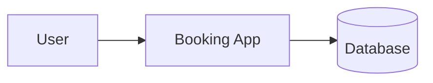
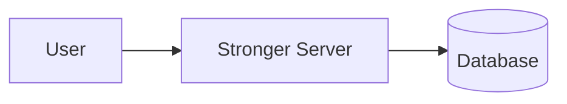
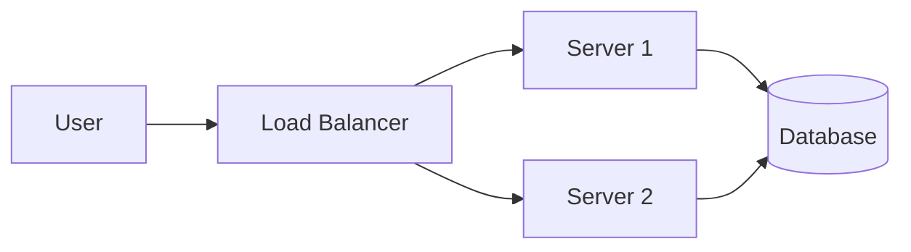
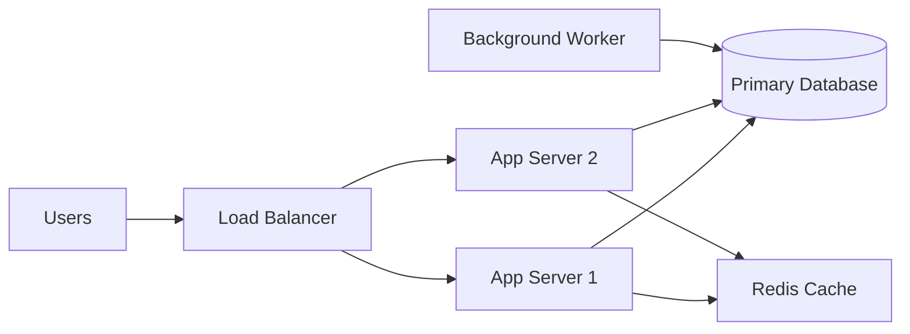

# Basic System Design Scenarios

## Scenario 1: Booking App on a Single Server

A booking application can initially run on a single server. This is a simple and low-cost setup, but it may not scale well as traffic grows.

### Architecture

### Problem
- The application becomes slow when many users try to book at the same time.
- A single server can become overloaded.

### Solution: Vertical Scaling
Increasing the server’s resources such as CPU, RAM, and storage is known as vertical scaling.

### Advantages
- Easier to implement
- Lower complexity
- Good for small systems

### Disadvantages
- Hardware has limits
- Expensive to upgrade repeatedly
- If the server fails, the application is unavailable
- This creates a single point of failure

---

## Scenario 2: Running the App on Multiple Servers

To improve reliability and handle more traffic, the application can be deployed on multiple servers.

This is called horizontal scaling.

### Benefits
- Better handling of increased traffic
- No single point of failure
- Improved availability and resilience

### Challenges
- More complex architecture
- Distributed systems are harder to manage
- Requires coordination between services
- A load balancer or orchestrator may be needed

---

## Scenario 3: Production-Style Booking System

In a real production environment, a booking system usually combines multiple components:
- users
- application servers
- database
- cache
- load balancer
- background workers

### Why this design is better
- Handles traffic efficiently
- Reduces server overload
- Keeps the service available even if one server fails
- Supports scaling as demand increases

---

## Comparison

| Approach | Description | Pros | Cons |
| --- | --- | --- | --- |
| Single Server | One machine hosts the app | Simple and cheap | Slow, fragile, single point of failure |
| Vertical Scaling | Increase resources on one server | Easy to start with | Limited by hardware and cost |
| Horizontal Scaling | Add more servers behind a load balancer | Scalable and reliable | More complex to manage |

---

## Summary

A booking system can start with a single server, but as user demand grows, the design must evolve. Vertical scaling adds more power to one server, while horizontal scaling distributes traffic across multiple servers for better availability and scalability. In real systems, teams usually combine both strategies with additional components such as load balancers, databases, and caches to support reliability and performance.
