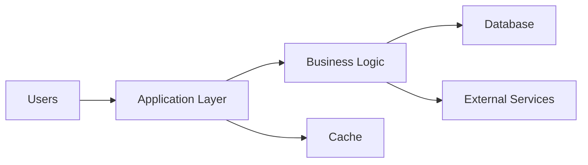

# What is System Design?

System design is the process of defining a system’s architecture, components, data flow, and interactions so it can be built and operated effectively.

## 1. What is a system?

A system is a collection of interconnected components working together to achieve a common goal.

### Examples of systems
1. Breathing system
2. Metabolism system
3. Paper printing system
4. Software system

> In simple terms, a system is any organized group of parts that performs a function.

## 2. What is design?

Design is the structured way in which components are arranged and coordinated so they function effectively as a whole.

A good design ensures that each part contributes to the overall purpose of the system rather than working independently.

## 3. What is system design?

System design is the practice of planning how a system should be structured so it can be developed, deployed, and maintained smoothly.

It focuses on:
- components and responsibilities
- communication between parts
- data storage and processing
- performance and scalability
- reliability and maintainability

## 4. Why is system design important?

System design helps teams make better decisions before implementation begins.

### Benefits of system design
- Gives developers a clear understanding of what needs to be built
- Helps estimate the cost of building and running the system
- Supports better technical and architectural decisions
- Improves scalability, efficiency, and reliability
- Reduces risk during development and deployment

## 5. Visual overview

## 6. Summary

System design is essential because it connects ideas to practical implementation. It helps teams build systems that are efficient, scalable, and easy to maintain while keeping costs and operational complexity under control.
